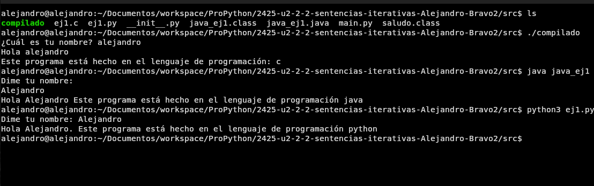

[](https://classroom.github.com/a/qQgBV5uk)
[](https://classroom.github.com/online_ide?assignment_repo_id=16621221&assignment_repo_type=AssignmentRepo)
# Práctica 2.2: Sentencias iterativas

Apoyate en los siguientes recursos para realizar la práctica:

[U2: 1. Sentencias iterativas](https://revilofe.github.io/section1/u02/practica/PROG-U2.-Practica002/)

---

# Título de la Actividad

## Identificación de la Actividad
- **ID de la Actividad:** (https://revilofe.github.io/section3/u01/practica/EDES-U1.-Practica011/#6-entrega)
- **Módulo:** EDES
- **Unidad de Trabajo:** Práctica 1.11 Elementos de desarrollo
- **Fecha de Creación:** 18/10/2024
- **Fecha de Entrega:** 19/10/2024
- **Alumno(s):** 
  - **Nombre y Apellidos:** Alejandro Bravo Calderón
  - **Correo electrónico:** abracal@g.educaand.es
  - **Iniciales del Alumno/Grupo:** abc

## Descripción de la Actividad
Esta actividad consiste en entender las diferencias entre los lenguajes interpretados, compilados y lenguajes que usan máquinas virtuales.

## Instrucciones de Compilación y Ejecución
1. **Requisitos Previos:**
   - Python3, java, c y gcc

2. **Pasos para Compilar el Código:**
   ```Para java: javac + <fichero>.java
      Para c: gcc <fichero> -o <fichero>
   ```

3. **Pasos para Ejecutar el Código:**
   ```Para python3: python3 + <fichero>
      Para c: ./<fichero>
      Para java: java <fichero>
   ```

4. **Ejecución de Pruebas:**
No hay pruebas

## Desarrollo de la Actividad
### Descripción del Desarrollo
Se ha realizado esta actividad enfocandome a explicar de forma sencilla y abstracta las características de cada tipo de lenguaje.

### Código Fuente
https://github.com/IES-Rafael-Alberti/2425-u2-2-2-sentencias-iterativas-Alejandro-Bravo2?tab=readme-ov-file

### Ejemplos de Ejecución
- **Entrada 1:** Dime tu nombre: 
- **Salida Esperada 1:** Tu nombre es: <nombre> este programa está hecho en el lenguaje de programación:

### Resultados de Pruebas
La verificación del código se ha realizado personalmente ya que por su simplicidad no ha sido necesario usar un depurador.
## Documentación Adicional
- **Manual de Usuario:** https://github.com/Alejandro-Bravo2
- **Autorización de Permisos:** El profesor si tiene permisos.

## Conclusiones
He aprendido las principales diferencias entre los lenguajes interpretados, compilados y ejecutados por máquinas virtuales.
Además he aprendido un poco de c y java.
## Referencias y Fuentes
https://www.it.uc3m.es/pbasanta/asng/course_notes/input_output_function_scanf_es.html
https://www.w3schools.com/java/java_user_input.asp

### Notas Adicionales:
1. **Nombres de Archivos y Repositorios:**
   - Asegúrate de que el nombre del archivo o repositorio siga la estructura definida: `XXX-idActividad-Iniciales`.
2. **Permisos:**
   - Verifica que el profesor tenga los permisos necesarios para acceder al repositorio o documento.
3. **Formato:**
   - Si se entrega en formato PDF o Google Docs, asegúrate de cumplir con el mínimo y máximo de folios establecidos.
4. **Compilación y Ejecución:**
   - Detalla claramente cómo compilar y ejecutar el código, incluyendo las instrucciones en el archivo `README.md`.


### 1. Objetivo
Evaluar la relación entre software y hardware, clasificar lenguajes de programación 
y comprender los diferentes procesos de ejecución (compilación, interpretación y 
máquinas virtuales), utilizando ejemplos de lenguajes interpretados, compilados y que
 generan código intermedio para su ejecución en una máquina virtual.


La relación entre software y hardware es que software son las instrucciones que se ejecutan sobre el hardware.

** Clasificación lenguaje de programación **
    1- Lenguajes interpretados: Son lenguajes que se ejecutan línea a línea, ya que hacen una conversión a 
    lenguaje máquina mientras se va ejecutando. No generá ningún código intermedio ni se ejecuta sobre ninguna máquina virtual.
    2- Lenguajes compilados: Son lenguajes que realiza una conversión de código fuente al código máquina especifico de cada máquina.
    3- Lenguajes ejecutados en máquina virtual: Son lenguajes que realizan una conversión de código 
    fuente a código intermedio y luego ese código intermedio se ejecuta sobre una máquina virtual lo cual
     permite portabilidad por que podremos usar el mismo código fuente en diferentes entornos.


### 5. Preguntas y Actividades para Evaluar Cada Criterio de Evaluación
Contesta a estás preguntas de forma concisa y clara. Las respuestas deben estar bien estructuradas e 
ir al grano. Si es necesario añade capturas de pantalla para ilustrar tus respuestas.
#### 5.1. Criterio de Evaluación 1.a: Relación entre Software y Hardware¶
**Preguntas**
Describe cómo el software que has creado se ha relacionado con los componentes físicos del dispositivo 
(memoria RAM, procesador, periféricos, etc.) durante la ejecución de los tres lenguajes (interpretado, compilado y en máquina virtual).

**C**
Primero hemos compilado el código en caso de c, ese código ha sido verificado para comprobar que no hayan fallos.
Una vez el código está compilado lo hemos ejecutado, guardando las partes del código en direcciones de memorias, 
el procesador fue leyendo esas direcciones de memoria y aumentando el contador de programa en 1,
el registro de instrucciones guarda la dirección de memoria que se va a ejecutar en ese momento,
la alu se encarga de las operaciones lógicas, en este caso de leer el valor introducido por el 
usuario que será recopilado por el dispositivo de entrada y se guardará en el buffer de entrada, 
luego se aumentará en 1 el contador de programa y se aumentará el registro de intrucciones, el 
procesador enviará el valor introducido por el usuario y la cadena de texto de: Hola este programa ha 
sido realizado por el lenguaje C/Java/Python al dispositivo de salida.

**Python**
Una vez que ejecutamos el código se empieza traducir de código fuente a código ejecutable mientras que lo vamos ejecutando.
Las partes del código se  irán guardando en direcciones de memorias, 
el procesador irá leyendo esas direcciones de memoria y aumentando el contador de programa en 1,
el registro de instrucciones guarda la dirección de memoria que se va a ejecutar en ese momento,
la alu se encarga de las operaciones lógicas, en este caso de leer el valor introducido por el usuario 
que será recopilado por el dispositivo de entrada y se guardará en el buffer de entrada, luego se aumentará 
en 1 el contador de programa y se aumentará el registro de intrucciones, el procesador enviará el valor 
introducido por el usuario y la cadena de texto de: Hola este programa ha sido realizado por el 
lenguaje C/Java/Python al dispositivo de salida.

**Java**

Primero se realiza una compilación del código fuente al código intermedio llamaod bytecode, 
ese código intermedio se pasa a una máquina virtual y lo traduce a lenguaje máquina para poder 
se ejecutado por el sistema operativo.
Las partes del código se  irán guardando en direcciones de memorias pero de esto se encarga la máquina virtual.
el procesador irá leyendo esas direcciones de memoria y aumentando el contador de programa en 1,
el registro de instrucciones guarda la dirección de memoria que se va a ejecutar en ese momento,
la alu se encarga de las operaciones lógicas, en este caso de leer el valor introducido por el
 usuario que será recopilado por el dispositivo de entrada y se guardará en el buffer de entrada,
  luego se aumentará en 1 el contador de programa y se aumentará el registro de intrucciones, el 
  procesador enviará el valor introducido por el usuario y la cadena de texto de: Hola este programa 
  ha sido realizado por el lenguaje C/Java/Python al dispositivo de salida.

#### 5.2. Criterio de Evaluación 1.c: Diferenciación entre Código Fuente, Código Objeto y Ejecutable
**Preguntas:**

**Explica cómo el código fuente que escribiste se transformó en código objeto y ejecutable en el**
**caso de los lenguajes compilados. ¿Generaste archivos intermedios (código objeto)? ¿Qué nombres tomaron estos archivos?**

El proceso de trasnformar de código fuente a código objeto es el siguiente:
El compilador analiza el código fuente y en caso de no haber ningún fallo entonces
 traducirá las instrucciones del código fuente y las agrupará en un fichero con extensión 
 .class en caso de ser de bytecode o c, este fichero contendrá todas las instrucciones traducidas, 
 también el enlazador hará referencia a las funciones que se encuentren en las bibliotecas o datos 
 usados en el código.

Sí generé archivos intermedios, el fichero .class y el fichero compilado de c .
El de java toma el nombre de la clase pública main y el de c tomó el nombre que quise por ejemplo yo le puse de nombre: compilado.


**Para los lenguajes interpretados, describe cómo el código fuente se ejecutó directamente, sin generar archivos de código objeto o ejecutable.** 
Lo que pasa cuando ejecutamos un lenguaje interpretado es que mientra lo vamos ejecutando el 
se va traduciendo a código máquina línea a línea.
Mientras que se realiza la interpretación el sistema operativo genera dos tipos estructuras
 dependiendo del lenguaje pero las más comúnes son: código de bajo nivel o estructura de datos.


**Para el lenguaje que genera código intermedio (Java, C#), explica cómo el código fuente se**
**transformó en código intermedio (bytecode) y cómo este fue ejecutado por la máquina virtual.**

El compilador analiza el código fuente y en caso de no haber ningún fallo entonces traducirá las 
instrucciones del código fuente y las agrupará en un fichero con extensión .class en caso de ser de bytecode
 o c, este fichero contendrá todas las instrucciones traducidas, también el enlazador hará referencia a las 
 funciones que se encuentren en las bibliotecas o datos usados en el código. Luego la máquina virtual usará 
 ese código intermedio para ajustarlo al sistema operativo y se encargará de la asignación de memoria y proporcionando una mayor seguridad.

#### 5.3. Criterio de Evaluación 1.d: Generación de Código Intermedio para Máquinas Virtuales

**Describe el proceso de generación de código intermedio (bytecode) en el lenguaje que utilizaste que**
**emplea una máquina virtual (por ejemplo, Java o C#).**

El proceso de generación de código intermedio se realiza a través de un compilador que en caso de java es 
javac, este compilador es el encargado de la verificación de la sintasis del código fuente y en caso de 
encontrar esos errores los mostrará en pantalla en forma de errores y no realizará la conversión a código intermedio.

**Explica qué rol juega la máquina virtual en la ejecución del código y cómo difiere de la ejecución**
**directa en un sistema operativo como ocurre con los lenguajes compilados e interpretados.**

Las máquinas virtuales juegan un rol importante en la ejecución del código ya que en los 
lenguajes como java se requieren para poder ejecutar el código pero lo importante de las 
máquinas virtuales es que gracias a ellas permiten una portabilidad entre sistemas operativos 
muy buena (Nos permiten usar el mismo código intermedio en muchos sistemas operativos distintos), 
también nos permiten una mayor seguridad ya que como de por medio tenemos una máquina virtual el 
código ejecutado no podá interactuar directamente con el sistema operativo dificultando a los atacantes
 hacer uso de vulnerabilidades. Como ya he dicho la máquina virtual aunque se esté ejecutando en un equipo
  permite un entorno aislado de la máquina anfitrion permitiendo ejecutar código intermedio sin necesidad 
  de conocer los detalles específicos del hardware.

#### 5.4. Criterio de Evaluación 1.e: Clasificación de Lenguajes de Programación

**Clasifica los tres lenguajes utilizados (interpretado, compilado y en máquina virtual) según su:**

- Modo de ejecución:
   - Interpretado: realiza una conversión de código fuente a código intermedio en su proceso de ejecución.
   - Compilado: Se ejecuta siguiendo el orden del código máquina compilado.
   - Máquina virtual: La máquina virtual es la encargada de la asignación de memoria y el código
    máquina se ejecuta directamente en el procesador.
- Nivel de abstracción:
   - Interpretado: La mayoría de lenguajes interpretados son de alto nivel por lo que es más cercano al lenguaje humano.
   - Compilado: La mayoría de lenguajes compilados usan una sintasis de nivel medio o casi bajo nivel,
    son un lenguaje intermedio entre el humano y la máquina, aunque la máquina no lo entienda.
   - Máquina virtual: Esta categoría está muy diversa ya que hay demasiada variedad de lenguajes 
   pero la gran mayoría son de alto nivel.
- Paradigma de programación:
   - Interpretado: Usan el paradigma imperativo y funcional. Aunque pueden llegar a ser multiparadigma 
   por ejemplo python pero la gran mayoria suelen ser imperativo o funcional.
   - Compilados: Usan el paradigma de imporativo, orientado a objetos.
   - Máquina virtual: Usan el paradigma de orientado a objetos, imperativo.

**Explica qué características de estos lenguajes influyeron en su clasificación.**

La principal característica es que se va a ver involucrado la forma en la ejecución del programa 
con el código fuente por lo que si por ejemplo queremos usan un paradigma que no soporta una máquina virtual
 provocaría un error ya que la forma en la que se almacenan las funciones, variables y partes del código
  interfieren en la ejecución del programa.

#### 5.5. Criterio de Evaluación 1.f: Evaluación de Herramientas Utilizadas en el Desarrollo¶

** Para cada uno de los tres lenguajes (interpretado, compilado y en máquina virtual), describe las 
herramientas que utilizaste en el proceso de desarrollo: **
   - Sistema operativo (¿en qué sistema ejecutaste el programa?): Lo ejecute en linux en concreto 
   la distribución de ubuntu.
   - Editor de texto o IDE (¿dónde escribiste el código?): Use vscode para editar el texto aunque 
   también use el editor de texto nano.
   - Compilador o intérprete (¿cómo se transformó o ejecutó el código?): El compilador usado por c 
   fue gcc y el de java fue javac y el intereprete de python3 fue python3. La ejecución fue mediante 
   llamada al módulo (./) o en caso de java fue java y el nombre del fichero y en caso de python3 fue python3.
   - Depurador (si lo usaste, ¿cómo lo empleaste para encontrar errores?): La verdad es que no usé 
   ningun depurador porque el código que realize era fácil.
   - Sistema de gestión de versiones (si lo usaste, ¿cómo guardaste las versiones del código?): Si 
   lo usé, y guardé las versiones del código subiendolas al repositorio de github creado por Edu.


#### 6. Entrega

Captura de pantalla del código ejecutado:



#### 7. Conclusión Final¶

**Al final del trabajo, se deberá reflexionar y entregar una conclusión, de no más de 10 líneas,**
**que compare las diferencias entre los tres lenguajes (interpretado, compilado y en máquina virtual), destacando:**

   - Diferencias de rendimiento:
      - Interpretado: El más lento de todos.
      - Compilado: El más rapido de todos.
      - Máquina virtual: Más rapido que interpretado pero más lento que compilado.
   - La facilidad o complejidad de cada proceso de ejecución.
      - Interpretado: El más fácil de todos.
      - Compilado: Mas fácil que usando una máquina virtual pero más dificil que interpretado.
      - Máquina virtual: El más dificil de todos.
   - Las ventajas y desventajas de cada tipo de lenguaje (interpretado vs compilado vs intermedio)
      - Interpretado:
         - Ventajas: Más cercano al lenguaje humano, es de alto nivel y permite una mayor abstracción del hardware.
         - Desventaja: No control del hardware, muy lento en ejecución.
      - Compilado:
         - Ventajas: Control del hardware, buen rendimiento.
         - Desventaja: Bajo nivel o nivel medio, dificil de aprender, seguridad.
      - Máquina virtual:
         - Ventajas: Portabilidad, Seguridad, rendimiento, alto nivel.
         - Desventajas: No control del hardware.